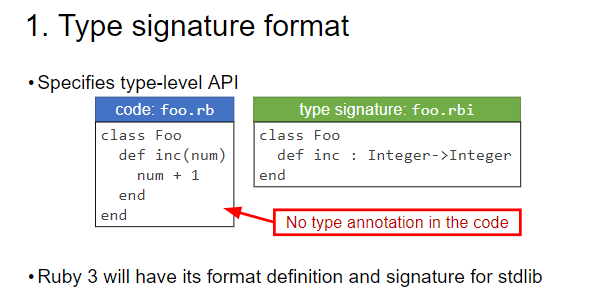

# Awesome Types & Type Signatures / Annotations for Ruby


## Type Signatures / Annotations

**Biggies**

- [Official Ruby::Signature :octocat:](https://github.com/ruby/ruby-signature) - official home of the Ruby Type Signature language (`.rbi`); incl. parser, the syntax and the semantics for type signatures (typesigs)
  - [Ruby Type Signature Language (RBI) Syntax Documentation Cheat Sheet](https://github.com/ruby/ruby-signature/blob/master/doc/syntax.md)
- [Steep :octocat:](https://github.com/soutaro/steep), [:gem:](https://rubygems.org/gems/steep) - gradual typing for ruby  
- [Sorbet](https://sorbet.org), [:octocat:](https://github.com/sorbet/sorbet), [:gem:](https://rubygems.org/gems/sorbet) - a ruby type checker from Stripe; [open sourced in summer 2019](https://sorbet.org/blog/2019/06/20/open-sourcing-sorbet)
  - More Sorbet Projects:
    - [sorbet-typed :octocat:](https://github.com/sorbet/sorbet-typed) - a central repository for sharing type definitions for ruby gems
    - [sorbet-rails :octocat:](https://github.com/chanzuckerberg/sorbet-rails) - a set of tools to make sorbet work with rails seamlessly
    - [Sord :octocat:](https://github.com/AaronC81/sord) - a tool to generate Ruby Signature language (`.rbi`) files from YARD documentation
    - [Parlour :octocat:](https://github.com/AaronC81/parlour) - a versatile Ruby Signature language (`.rbi`) generator and plugin system
    - [sorbet-progress :octocat:](https://github.com/jaredbeck/sorbet-progress) - measure your progress as you adopt sorbet, stay motivated!

**More**

- [Contracts for Ruby (contracts.ruby) :octocat:](https://github.com/egonSchiele/contracts.ruby), [:gem:](https://rubygems.org/gems/contracts) - a contract is one line of code that you write above a method definition; it validates the arguments to the method, and validates the return value of the method
- [Rubype (Ruby+Type) :octocat:](https://github.com/gogotanaka/Rubype), [:gem:](https://rubygems.org/gems/rubype) - gradual type checking for Ruby
- [Typedocs :octocat:](https://github.com/todesking/typedocs), [:gem:](https://rubygems.org/gems/typedocs) - method type annotations for Ruby
- [Typecheck :octocat:](https://github.com/plexus/typecheck), [:gem:](https://rubygems.org/gems/typecheck) - type checking for Ruby methods 
- [Ruby Type Checker (Rtc) :octocat:](https://github.com/plum-umd/rtc)  
- [RDL - Types, type checking, and contracts for Ruby :octocat:](https://github.com/plum-umd/rdl) - a lightweight system for adding types, type checking, and contracts to Ruby. In RDL, types can be used to decorate methods


## Articles

- [Type Checking in Ruby - Check Yo Self Before You Wreck Yo Self](https://blog.appsignal.com/2019/08/27/ruby-magic-type-checking-in-ruby.html) by Michael Kohl, Aug 2019


## Types

### Bool

- [Bool Type :octocat:](https://github.com/typesigs/safebool) - safebool gem / library - safe bool / boolean type adds Bool(), to_b, parse_bool / to_bool, bool?, false?, true?, true.is_a?(Bool)==true, false.is_a?(Bool)==true, and more 

### Enums / Flags

- [Enum / Flag Types :octocat:](https://github.com/typesigs/enums) - enums library / gem - safe enum / enumeration types - a set of symbolic keys bound to unique integer numbers (incl. bit flags option)

### Bytes / Buffer / (Frozen) String

- [Bytes / Buffer Types :octocat:](https://github.com/typesigs/bytes)


### Records

- [Record Type :octocat:](https://github.com/typesigs/records) - records gem / library - frozen / immutable structs with copy on updates


### Structs


### Typed Arrays / Typed Hashes

- [Typed Arrays / Typed Hashes :octocat:](https://github.com/s6ruby/safestruct) - safestruct gem / library - safe data structures (array, hash, struct) - say goodbye to null / nil (and maybe) - say hello to zero


### (Algebraic) Data (Union) Types with Variants

- [Data Type :octocat:](https://github.com/typesigs/safedata) - safedata gem / library - safe (algebraic) union data types with (enumerated) variants


### More / Misc Types

- [Types :octocat:](https://github.com/dry-rb/dry-types) - dry-types gem / library - flexible type system with coercions and constraints 


## Ruby 3  

_Ruby 3 Expected for December 2020 (Hopefully) - Planned Next Version After Ruby 2.7 Expected for December 2019_

#### Static Analysis

Ruby 3 static analysis will have four items:

1. Type signature format (`.rbi`) 
2. Level-1 type checking tool 
3. Type signature profiling / prototyping tool 
4. Level-2 type checking tools




(Source: [RubyKaigi 2019 Progress Report on Ruby 3 Talk Slides](https://docs.google.com/presentation/d/1z_5JT0-MJySGn6UGrtdafK1oj9kGSO5sGlTtEQJz0JU/view#slide=id.g57cf166414_14_5))


## Crystal

_Ruby with 100 % static types compiled to binaries via LLVM_

> Crystal is statically type checked, so any type errors will be caught early by the compiler rather than fail on runtime. 
> Moreover, and to keep the language clean, Crystal has built-in type inference, so most type annotations are unneeded.

``` crystal
def shout(x)
  # Notice that both Int32 and String respond_to `to_s`
  x.to_s.upcase
end

foo = ENV["FOO"]? || 10

typeof(foo)        #=> (Int32 | String)
typeof(shout(foo)) #=> String
```

(Source: [Crystal Lang - Type System](https://crystal-lang.org/#type-system))

> All types are non-nilable in Crystal, and nilable variables are represented as a union between the type and nil. 
> As a consequence, the compiler will automatically check for null references in compile time,
> helping prevent the dreadful billion-dollar mistake.

``` crystal
if rand(2) > 0
  my_string = "hello world"
end

puts my_string.upcase
```

> Running the previous file:

```
$ crystal hello_world.cr
Error in hello_world.cr:5: undefined method 'upcase' for Nil (compile-time type is (String | Nil))

puts my_string.upcase
               ^~~~~~
```

(Source: [Crystal Lang - Null Reference Checks](https://crystal-lang.org/#null-reference-checks))


## Python

_Learning from Type Checkers / Signatures / Annotations in Python_

New in Python version 3.5.

- [typing — Support for type hints](https://docs.python.org/3/library/typing.html)

> The typing module supports type hints as specified by PEP 484 and PEP 526.
> The most fundamental support consists of the types `Any`, `Union`, `Tuple`, `Callable`, `TypeVar`, and `Generic`. 
> For full specification please see PEP 484. For a simplified introduction to type hints see PEP 483.

More type checkers / signatures / annotations:

- [mypy - Optional Static Typing for Python](http://mypy-lang.org)
- [Pyre is a performant type checker for python :octocat:](https://github.com/facebook/pyre-check) by Facebook
- [Pyright static type checker for python :octocat:](https://github.com/Microsoft/pyright) by Microsoft
- [Pytype static type analyzer for python :octocat:](https://github.com/google/pytype) by Google


## More Articles

- [What To Know Before Debating Type Systems](https://blog.steveklabnik.com/posts/2010-07-17-what-to-know-before-debating-type-systems) by Chris Smith, 2010


## Meta

**License**

The awesome list is dedicated to the public domain. Use it as you please with no restrictions whatsoever.

**Questions? Comments?**

Send them along to the ruby-talk mailing list. Thanks!
